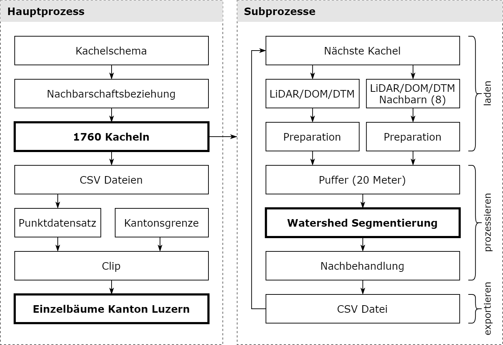
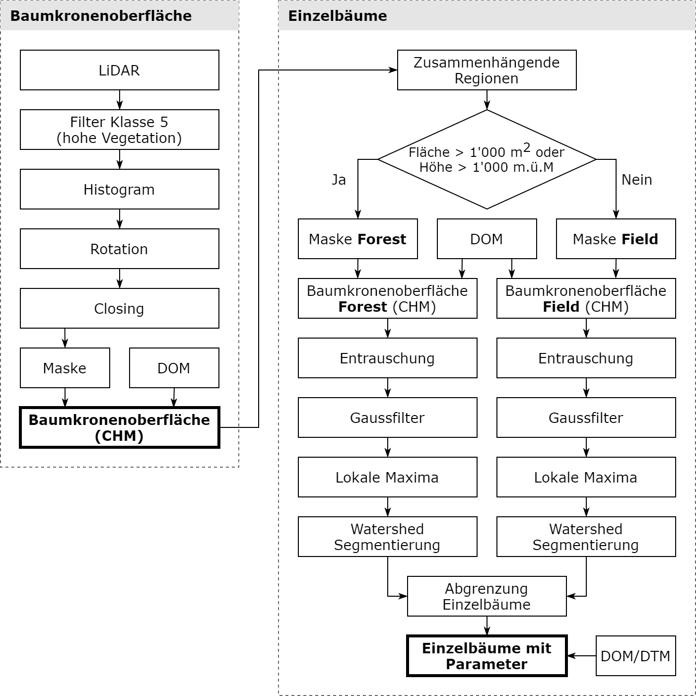

Tree detection
==============
Command line application (CLI) to delineate single trees from LiDAR data, DOM and DTM.
Realized as a master thesis for the canton of Lucerne to obtain the UNIGIS Master of Science (MSc) degree at the Paris-Lodron University Salzburg

The workflow to detect trees is separated in a main process and several sub processes.
The main process is calculating the neighborhood for all tiles and setup the sub processes.
In case of multiple processes, the tiles will be processed in parallel. 
After finishing of all sub processes, the main process is exporting the trees to a file geo
database and clip it to the boundary of the canton.

In the sub processes the las-, dom- and dtm-files are prepared, buffered before the watershed
segmentation.

The watershed delineation is executed on the canopy height model extracted from
LiDAR and DOM data. The delineation will be executed for forest and open field areas
with individual settings (`settings/settings.json`).

Precondition and data
---------------------
The algorithm needs access to the tiled LiDAR point cloud and the tiled DOM and DTM.
The data should be tiled with **equal raster schema** (e.g. Kartenblatt 1/56).
The raster tiles should be accessible in a polygon feature class to extract all tiles
and cartesian 8-neighborhood.
To clip all trees to the boundary of the area of interest, a polygon to this data is additionally required.
Setup the path to all the data in the configuration file. 
The access to all required data will be checked before starting the process.

There's no need for a big amount of free hard disk space. The trees will be exported to CSV files
and summarized in a point feature class. Overall free disk space of 2.5 MB per square kilometer is needed.

Depending of the amount of parallel processes and hardware characteristics,
the algorithm will have a runtime between 1 and 2 minutes per square kilometer.

Installing
----------
The follwing steps describes the installing process in the IT environment of the canton of Lucerne.
1. Setup a new conda environment and install all required packages according the `setup.py` file.
2. Start the Python 3 conda environment with `"C:\Program Files\ArcGIS\Pro\bin\Python\scripts\proenv.bat"`
3. Insert `pip install git+https://app.geo.lu.ch/gitea/GEO/tree-detection.git` to install the newest release
4. Use credentials for Gitea

Running
-------
1. Configure all parameters in the settings file `settings/settings.json`
2. Configure the path to the conda environment with all installed libraries in `run.bat`
2. Start tree detection by running the script `run.bat`

Uninstalling
------------
If you want to uninstall tree-detection (e.g. in case of an update), use the following steps:
1. Check or set in ArcGIS Pro the environment to the tree-detection environment
2. Start the Python 3 conda environment with `"C:\Program Files\ArcGIS\Pro\bin\Python\scripts\proenv.bat"`
3. Insert `pip uninstall tree-detection` to uninstall the newest release
4. Answer with `y` to complete the uninstall process

Releases
--------
| Date         | Version | Notes                                                    |
|--------------|---------|----------------------------------------------------------|
| 31.03.2020   | 1.0.0   | Initial release                                          |